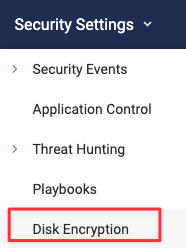
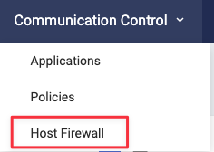

FortiEDR 7.0 offers multiple new features that will move the product line further ahead in terms of capabilities and security coverage. 

## New Dashboards :tv:

EDR 7.0 delivers a new dashboard experience with customizable widgets to create a unique view for each analyst using the console. Improvements to the UI provide FortiEDR administrators a more modern look and feel. 

The following is the previous 6.2 dashboard view:

Here is a view of the new 7.0 dashboard:

## Investigation View, Audit History, & Analyst Workflow :man_technologist:

The new *Investigation View* provides a wealth of insight including an *Event Analysis* pane that provides an extensive amount of information:

The *Overview* pane provides the history of an event as well as a means for analysts to note and track work being done for each event:

## Disk Encryption :floppy_disk:

FortiEDR 7.0 allows enforcement of native OS tools such as disk encryption.

{}Many EPP tools will implement their own mechanisms such as disk encryption which ultimately lead to bloat on an endpoint. FortiEDR will simply leverage tools already part of the endpoint's operating system, allowing security teams to leverage tools already at their disposal.{}

A new policy category can be accessed under *Security Settings > Disk Encryption*.

Policies for disk encryption are based on the OS type and version. In the following case the **Xperts-Disk-Enc** policy is assigned to the **Demo - Installers** group  which allows the policy to be applied granularly.

Policies can now also be viewed by navigating to *Inventory > Collectors*. Here we can see the Policy name, State, Method (Operating System), Attribute, and applied Collector Group. Click the ellipsis for the *Method* provides details of the policy.

## Host Firewall Configuration :man_firefighter: 

Enhancements within *Communication Control* provide FortiEDR 7.0 to manage the native host based firewall built into the OS. These settings are located under *Communication Control > Host Firewall*:

Firewall rules can be applied to collector groups and support for OSX exists as well:

## Device Compliance :memo:

The new layout found under *Inventory > Collectors* allows for information on both **Disk Encryption** and **Device Security**. By mousing over the compliance status a tool tip appears that shows which native security mechanisms are enabled/disabled on the endpoint.

