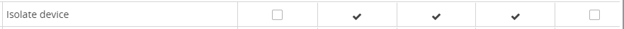
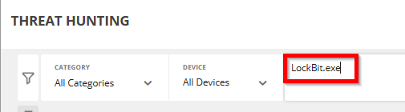

In this lesson we'll explore how adversaries may use multiple tactics to achieve a particular action. One of the ways that adversaries use multiple tactics is when attempting to move laterally through a network. Following through on their primary objective often requires exploring the network to find their target and subsequently gaining access to it. Reaching their objective often involves pivoting through multiple systems and accounts to gain further access. Adversaries might install their own remote access tools to accomplish Lateral Movement or use legitimate credentials with native network and operating system tools, which may be stealthier.

### Tactic :gear:

**Lateral Movement** [ID:TA0008](https://attack.mitre.org/tactics/TA0008/)

The adversary is trying to move through your environment.

---

{}Lockbit will actually use a reconnaissance tactic to scan the network for other IPs that can be used for lateral movement.{}

### Tactic :gear:

**Reconnaissance** [ID: TA0043](https://attack.mitre.org/tactics/TA0043/)

The adversary is trying to gather information they can use to plan future operations. Reconnaissance consists of techniques that involve adversaries actively or passively gathering information that can be used to support targeting.

### Technique :bulb:

**Active Scanning** [ID:T1595](https://attack.mitre.org/techniques/T1595/)

Adversaries may execute active reconnaissance scans to gather information that can be used during targeting. Active scans are those where the adversary probes victim infrastructure via network traffic, as opposed to other forms of reconnaissance that do not involve direct interaction.

### Sub-Technique :bulb:

**Scanning IP Blocks** [ID: T1595.001](https://attack.mitre.org/techniques/T1595/001/)

Adversaries may scan victim IP blocks to gather information that can be used during targeting. 

---

### Mitigation :stop_sign:

**Pre-Compromise** [ID:M1056](https://attack.mitre.org/mitigations/M1056/)

This technique cannot be easily mitigated with default system tools.

---

### FortiEDR Prevention :police_officer:

One of the most devastating aspects of a ransomware attack is that many variants have the ability to spread through a network once a single device is encrypted. One mechanism that FortiEDR can use to prevent further impact to a network is by using device **isolation**.

Automatic Incident Response (AIR) playbooks can be configured to isolate a device via the FortiEDR Collector, or to leverage FortiNAC for isolation. 

1. In the FortiEDR [Central Manager](https://xperts2025.fortiedr.com/) (`xperts25` / `xPerts_54321$`) navigate to *Security Settings > [Playbooks](https://xperts2025.fortiedr.com/#/security_settings/playbooks)* and expand the *Default Playbook*.

**Isolate device with Collector**: This action blocks the communication to/from the affected Collector. This action only applies for endpoint Collectors. For example, if the Playbook policy is configured to isolate the device for a malicious event, then whenever a maliciously classified security event is triggered from a device, then that device is isolated (blocked) from communicating with the outside world (for both sending and receiving). 

A checkmark  in a classification column here means that the device is automatically isolated when a security event is triggered with that classification.

**Isolate device with NAC**: This action blocks the communication to/from the affected device by disabling this host on an external Network Access Control system. A NAC connector must already be configured in order to perform this action. 

---

### Detection :mag:

**Network Traffic Flow** [ID:DS0029](https://attack.mitre.org/datasources/DS0029/#Network%20Traffic%20Flow)

Monitor network data for uncommon data flows. Processes utilizing the network that do not normally have network communication or have never been seen before are suspicious.

---

### FortiEDR Detection :detective:

The LockBit ransomware scans for port 135 which is captured by the FortiEDR threat hunting telemetry. Port 135 is used for RPC client-server communication. We'll learn how to use **facets** to quickly identify this activity.

The continuous, realtime collection of Threat Hunting data produces numerous activity events. The sheer volume of activity data can make working directly with these activity events seem cumbersome at times. Therefore, FortiEDR uses **facets** to summarize the data displayed in the results tables. **Facets** are predefined in FortiEDR and represent the same data that is displayed in the results tables, but in an aggregated form. As such, facets represent the aggregation of the values in the results tables.

1. Login to the FortiEDR [Central Manager](https://xperts2025.fortiedr.com/) (`xperts25` / `xPerts_54321$`)
2. Click on *Threat Hunting*.
3. In the Filters dialog box type `LockBit.exe` and press enter. This will display numerous entries in the Activities Event Table.

4. Click the small *triangle* below the *filter* section to reveal the **Facets and Results Tables**.

Each individual facet pane summarizes the top five items for that facet. For example, in the Type (action) facet below, the facet lists the top five actions, based on the filters applied in the query. The number at the top in parentheses () indicates the total number of different values for this facet in the results table, in this case 16. In this case, the top five actions are Library Loaded, File Write, File Rename, File Create, and Process Creation.

5. Click the **More** link to display additional facets.

Facets provide an easy-to-use mechanism to aggregate the results in the Activity Events tables. In addition, you can also further narrow the results in the Activity Events table directly from the facets by including or excluding specific values. For example, when you hover over an item in a facet pane, a green and red button appear in its row. 

6. In the **Remote Port** table hover over port 135 and click the green plus button to include that item as a filter. This item will be highlighted in green indicating it has been marked as an inclusion filter.
7. Click the **Apply** button to apply the additional filtering criteria to the threat hunting query.

 In addition, it creates a chip (indicated by the arrow in the following picture), which represents the additional filters and displays it at the top of the Facets area.

 

 Hovering over a chip enables you to remove, disable or copy it, as follows:

 

 | Tool | Definition |
|-------------------|--------------|
|Remove|The chip is removed and the Facets and Result tables are updated accordingly.|
|Disable|A disabled chip no longer affects the results. The Facets and the Results tabs are updated as if the chip was removed.|
|Copy|The chip content is copied to memory and can be pasted into the query for further editing.|

{}Once the broadcast domain is identified LockBit will scan the network iterating from the network ID address and incrementing up to the broadcast address trying to connect over ports 135 or 445, if successful it will try to encrypt the network hosts.{}

---

### Going Further :rocket:
- The [FortiGuard Managed Detection and Response (MDR)](https://www.fortinet.com/solutions/enterprise-midsize-business/mdr) Service is designed for customers of the FortiEDR advanced endpoint security platform. This team of threat experts monitors, reviews and analyzes every alert, proactively hunts threats, and takes actions on behalf of customers to ensure they are protected according to their risk profile.

---

### [Capture The Flag](http://3.19.227.225:8000/) :checkered_flag:
In the FortiEDR [Central Manager](https://xperts2025.fortiedr.com/) (`xperts25` / `xPerts_54321$`) Threat Hunting module use the **Facets and Results** table identify the text **file created** by LockBit that has information on how to decrypt the data.

| # | Question/Flag | Points |
|---|---------------|:--------:|
| 1 | **Ransom Note:** What is the name of this file?  | 5 |
| 2 | **A Layered Approach:** Find how to retrieve this file within the Threat Hunting module. Once retrieved, what is the URL of the first TOR site listed to contact the ransomware operator?  | 10 |
