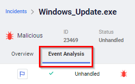

This lab will focus on identifying Command and Control (C2) activity. In addition, we'll see how FortiEDR's Automated Incident Response (AIR) playbooks can automate immediate responses to these communication channels. Rapid responses to this type of activity is critical to reducing **Mean Time to Detect (MTTD)** and **Mean Time to Respond (MTTR)**.

### Tactic :gear:

**Command and Control** [ID:TA0011](https://attack.mitre.org/tactics/TA0011/)

The adversary is trying to communicate with compromised systems to control them.

Command and Control consists of techniques that adversaries may use to communicate with systems under their control within a victim network. Adversaries commonly attempt to mimic normal, expected traffic to avoid detection. There are many ways an adversary can establish command and control with various levels of stealth depending on the victim’s network structure and defenses.  

### Technique :bulb:

**Application Layer Protocol** [ID:T1071](https://attack.mitre.org/techniques/T1071/)

Adversaries may communicate using OSI application layer protocols to avoid detection/network filtering by blending in with existing traffic. Commands to the remote system, and often the results of those commands, will be embedded within the protocol traffic between the client and server.

#### Sub-Technique :bulb:

**Web Protocols** [ID:T1071.001](https://attack.mitre.org/techniques/T1071/001/)

Adversaries may communicate using application layer protocols associated with web traffic to avoid detection/network filtering by blending in with existing traffic. 

### Mitigation :stop_sign:

**Network Intrusion Prevention** [ID:M1031](https://attack.mitre.org/mitigations/M1031/)

Network intrusion detection and prevention systems that use network signatures to identify traffic for specific adversary malware can be used to mitigate activity at the network level. 

### FortiEDR Prevention :police_officer:

1. Click on *Incidents* in the FortiEDR [Central Manager](https://xperts2025.fortiedr.com/)
2. Find the incident where *cloud.exe* is spawned as a child process of *Windows_Update.exe*
3. Review the event graph, noting that *cloud.exe* is making a network connection to IP *1.123.37.68*. Click on the *Investigate* button.

4. Select the *Event Analysis* tab for this incident.

5. Click on the elipsis for *Incident Response* and expand the *Malicous* entry to reveal the Automatic Incident Response action.

In this case FortiEDR has leveraged an integration with a FortiGate to block this IP due to a malicious classification.
6. Click the elipsis for *Automated Analysis* and then expand the *Network & Extended Data* section.

FortiEDR native integration with [FortiGuard Labs](https://www.fortinet.com/fortiguard/labs) allows up-to-date intelligence, supporting
real-time incident classification to enable accurate incident response playbook activation.

#### Playbooks

The FortiEDR Playbooks feature determines which automatic actions are triggered, based on the classification of a security event. Playbook policies enable administrators to preconfigure the action(s) to be automatically executed according to a security event’s classification. 

1. Select *SECURITY SETTINGS > Playbooks*. The AUTOMATED INCIDENT RESPONSE – PLAYBOOKS page displays a row for each Playbook policy.
2. Expand the **Default Playbook** policy row to show the actions it contains.

Playbook policy actions are divided into the following types:
- Notifications
- Investigation
- Remediation
- Custom

Each of these categories contains different types of actions that can be performed when a security event is triggered.

3. Note that *Remediation* actions can be one of the following types:
- Terminate process
- Delete file
- Clean persistent data
- Block address on Firewall

4. Note that in our case the *Block address on Firewall* remediation is configured to block *Malicious* and *Suspicious* events on the firewall named *"HQ"*. This action ensures that connections to remote malicious addresses that are associated with the security event are blocked. A Firewall Connector must already be configured in order to perform this action.

### Detection :mag:

**Network Traffic Flow** [ID:DS0029](https://attack.mitre.org/datasources/DS0029/)

Monitor for web traffic to/from known-bad or suspicious domains and analyze traffic flows that do not follow the expected protocol standards and traffic flows.

### FortiEDR Detection :detective:

A common threat hunting practice for organizations is to search for communications with new, and well known, command and control addresses. With FortiEDR you can simply use a free text query to check communication to the malicous IP address we just reviewed.

1. Click on *Threat Hunting* in the FortiEDR [Central Manager](https://xperts2025.fortiedr.com/). 
2. Perform a search for `1.123.37.68`
3. Click on the entry to show details of this connection, notice the remote port.
4. Click the *Investigation View* button to open a new window for further inspection.

5. Within this workbench view click on the *leaf* for the IP address which will provide information within the tray on the right of the screen. Click the *Insights* tab to show the options to investigate how many distinct processes, or devices, in an environment have communicated with this IP.

### Going Further :rocket:
- Review the FortiEDR/FortiGate integration by going to *Administration > Integrations* and checking the configuration of the firewall connector.
- Learn more about [C2](https://www.fortinet.com/resources/cyberglossary/command-and-control-attacks) attacks using Fortinet's cyber glossary.

