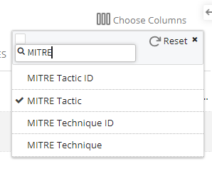

In this lab we'll learn how FortiEDR can block common persistence techniques out-of-the-box. We'll also see how FortiEDR incorporates MITRE tagging within the Threat Hunting module.

### Tactic :gear:

**Persistence** [ID: TA0003](https://attack.mitre.org/tactics/TA0003/)

The adversary is trying to maintain their foothold.

Persistence consists of techniques that adversaries use to keep access to systems across restarts, changed credentials, and other interruptions that could cut off their access. Techniques used for persistence include any access, action, or configuration changes that let them maintain their foothold on systems, such as replacing or hijacking legitimate code or adding startup code.

### Technique :bulb:

**Boot or Logon Autostart Execution** [ID: 1547](https://attack.mitre.org/techniques/T1547/)

Adversaries may configure system settings to automatically execute a program during system boot or logon to maintain persistence or gain higher-level privileges on compromised systems. 

### Sub-Technique :bulb:

**Registry Run Keys / Startup Folder** [ID: T1547.001](https://attack.mitre.org/techniques/T1547/001/)

Adversaries may achieve persistence by adding a program to a startup folder or referencing it with a Registry run key. Adding an entry to the "run keys" in the Registry or startup folder will cause the program referenced to be executed when a user logs in.

### Mitigation :stop_sign:

**Windows Registry Key Modification**

This type of attack technique cannot be easily mitigated with preventive controls since it is based on the abuse of system features.

### FortiEDR Prevention :police_officer:

Although built-in Windows features cannot mitigate this technique FortiEDR does have policies in place to effectively thwart modifying of OS settings.

1. Click on *Incidents* in the FortiEDR Central Manager
2. Click on the incident for *Lockbit.exe*.
3. Look at the various incidents in the presented event graph to identify an incident showing an attempted change to the registry.

FortiEDR excels at providing post-execution protection that stops advanced malware in real time. In this case, when a process attempts to modify OS settings such as changing the registry, FortiEDR rules provide prevention.

4. Click on the blue *Investigate* button to analyze this event further.
5. Click on the *Event Analysis* tab in the Investigation View window.

Here we can see various details specific to this incident. Notice that FortiEDR has marked the process activity with **Destination: Modify OS Settings** and the event graph shows the registry key that Lockbit.exe attempted to change.

6. Click on the elipsis next to *Incident Response* to review the details of how FortiEDR can block this registry key change.

{}In addition to out-of-the-box response actions FortiEDR can orchestrate incident response operations using tailor-made playbooks. We'll see playbooks in action in a later lesson.{}

### Detection :mag:

**Windows Registry Key Modification** [ID: DS0024](https://attack.mitre.org/datasources/DS0024/)

Monitor Registry for changes to run keys that do not correlate with known software, patch cycles, etc.

### FortiEDR Detection :detective:

Each FortiEDR threat hunting activity event may be a part of a behavior and/or a MITRE Technique. 

1. Click on *Threat Hunting* in the FortiEDR Central Manager.
2. You can select which columns should appear in any of the tables using the Choose Columns option at the far right of the page. You can type in the Search box to help narrow the list of columns that display. Type `MITRE` and choose the *MITRE Tactic* column.

3. In the filter dialog box enter `Source.Process.Name: ("Lockbit.exe") and MITRE.Tactic: ("Persistence")` and press *enter*. The activity events that have such behaviors and/or MITRE indications have values in the related columns in the activity events tables, as shown below:

4. When an activity event has a related MITRE indication, it is indicated in the Details pane. Click on one of the entries shown to expand the details pane. You can hover over the associated MITRE icon to display more details.

### Going Further :rocket:
- Review this summary of how FortiEDR performed in the latest round MITRE evaluations: [Reveling in the MITRE ATT&CK Evaluation Results](https://www.fortinet.com/blog/business-and-technology/fortiedr-mitre-attack-evaluation-results)