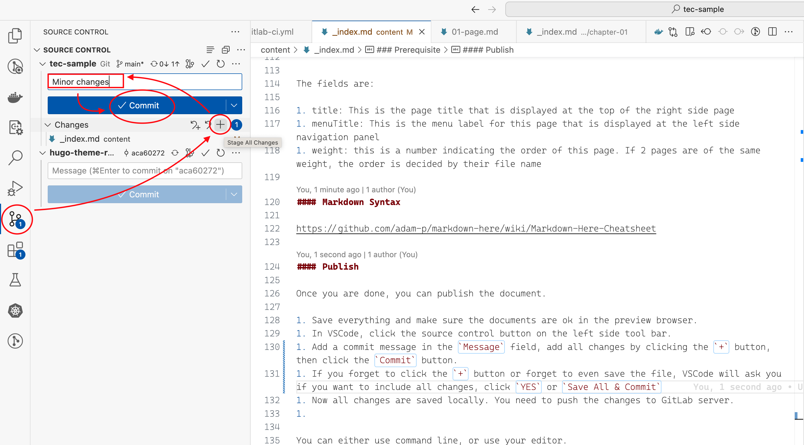

Once you are done, you can publish the project to the tec website. GitLab CI/CD is already configured to automatically publish according to your git command.

When you release with a tag of format **v1.2.3**, the CI/CD will automatically publish to the production server. If you are familiar with git, you will see the following steps just carry out exactly these two tasks.

## Git Commit and Git Push

You can do this step as many times as you like. It is equivalent to
saving files to the remote gitlab server.

### Through VSCode GUI

1. Save everything and make sure the documents are ok in the preview browser.
1. In VSCode, click the **Source Control Button** 
   on the left side tool bar.
1. Add all changes by clicking the **+** button on the **Changes** row. Notice the **+** button will show up when you mouse over the **Changes** row, and for each individual changed file, there is also a **+** button, which only add that file. The **+** button on the **Change** row adds all changes.
1. Add a commit message in the **Message** field
1. Click the **Commit** button.
1. Now all changes are saved locally. You need to push the changes to GitLab server.
   1. The **Commit** button will change its label to **Sync Changes**
   1. Click the **Sync Changes** button to push changes to GitLab server

> If you forget to click the **+** button or forget to even save the files, VSCode will ask you if you want to include all changes, click **YES** or **Save All & Commit**



### Through Command Line

Alternatively, if you are comfortable with git command line, you can do this through command line:

1. Make sure current git status is ok:
   ```sh
   git status
   ```
1. Stage all changes:
   ```sh
   git add .
   ```
1. Commit all staged changes:
   ```sh
   git commit -a -m 'brief description of this edit'
   ```
1. Push to gitlab server:
   ```sh
   git push
   ```
   If this is the first time you do a `git push`, it will fail and tell you to use a longer command to push: `git push --set-upstream origin [your branch name]`. Use that. The next time, you can just use `git push`.

Now we can move the the next step to tag.

## Publish to Production Server

Once you make sure everything is ok. You can do the following to publish to the production server:

1. You need to decide a version for this publication. A version string has to be in a certain format so the CI/CD system can recognize it. The string needs to be like **v[MAJOR].[MINOR].[PATCH]**, where **MAJOR**, **MINOR** and **PATCH** are all numbers.

   For example,

   - these are valid version string: **v0.0.1**, **v0.0.2**, **v1.0.0**, and **v2.20.10**.
   - These are invalid version string: **1.0.0** (missing leading letter **v**), **v1.0** (missing patch level), **v1.0.0.0** (extra number), **v1.0.a** (should be a number)

1. Let's say your release version is **v1.0.0**, now do the following command in the terminal, (in the folder of your project):

   ```shell
   cd [PROJECT_NAME]
   git tag v1.0.0
   git push origin v1.0.0
   ```

1. After a few minutes, the document should be automatically published at https://tec.myfortinet.com/[PROJECT_PATH]/[PROJECT_NAME]/. You will be prompted to login, and you can login with Fortinet login credentials.

1. The next time when you want to publish a new version, pick a larger version string, for example if you already have **v1.0.0**, then the next release can be **v1.0.1** if there are very small changes, or **v1.1.0** if there are minor changes, or **v2.0.0** if there are major changes.

{}
The url of the project will be the gitlab path + project name, without the `tec-content` part. For example, if the project is at `tec-content/competency/how-to-sase`, then the published URL will be `https://tec.myfortinet.com/competency/how-to-sase`.
{}

## Git Branch and Collabration

If you are working on the project by yourself, it is ok to work on the **main** branch all the time. But if more people are working on
the same project at the same time, it is better to create your own
branch, then merge your changes into main. In the [Git](chapter-03-git) chapter, we will discuss the work flow.
