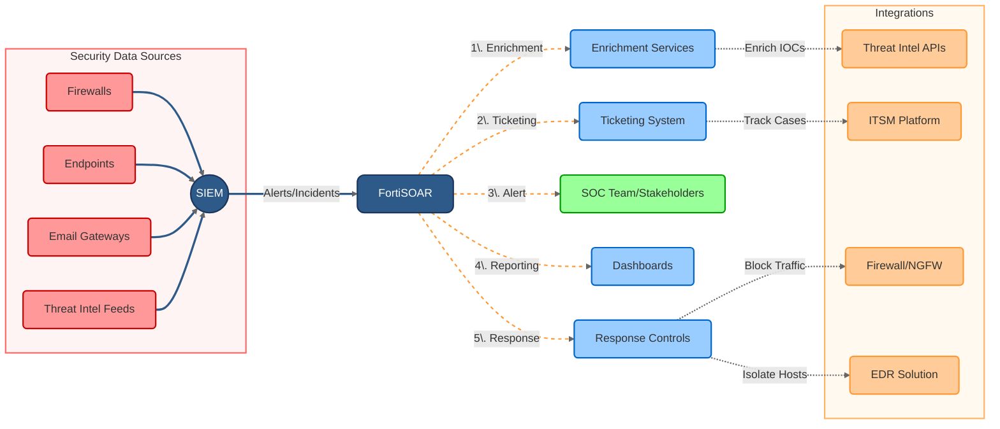

This is a high-level overview of the FortiSOAR architecture. The platform integrates with various security tools and data sources, enriches alerts, and automates response actions. The SOC team interacts with the platform to manage incidents and generate reports. The great part about FortiSOAR is its ability to integrate with **third-party tools** and platforms, enabling seamless data sharing and response actions.
